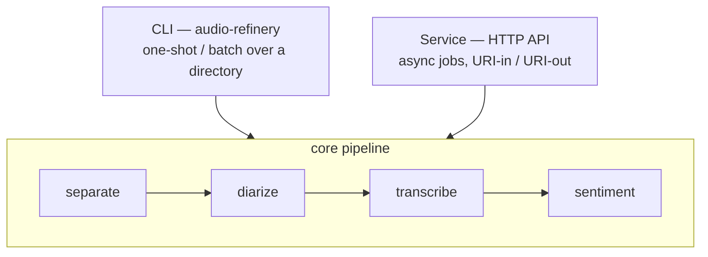

# Audio Refinery

GPU-accelerated audio processing pipeline: vocal separation (Demucs), speaker diarization (Pyannote), transcription (WhisperX), and text sentiment analysis. Its primary use case is building AI-ready audio databases — transforming raw recordings into structured, speaker-attributed JSON with word-level timestamps that feed directly into RAG pipelines, vector stores, and fine-tuning datasets. The pipeline uses a Ghost Track strategy: AI models run against a clean, music-free vocal stem to maximize accuracy, then the resulting metadata is applied back to the original audio, preserving its acoustic character. Designed to run on 24 GB consumer GPUs with all models resident in VRAM simultaneously, it processes large corpora in batch with no model reload overhead between files.

## Choose your path

Audio Refinery runs in two modes that share the same core pipeline. Pick the one that fits your workflow:

### Run one-off transcriptions on a workstation — CLI

Install locally and process a file or a whole directory from the command line:

```bash
make dev-setup                                      # install (Python 3.11 + uv)
audio-refinery pipeline --base-dir /data/audio/batch
```

Best for interactive use, ad-hoc processing, and batch runs over a local directory.

→ **Full command reference: [docs/cli.md](docs/cli.md)**

### Deploy at scale behind an HTTP API — service

Run the containerized service and submit jobs over HTTP (URI-in / URI-out, async, multi-job batches):

```bash
docker run --gpus all -p 8000:8000 \
  -e REFINERY_API_KEYS=your-secret-key \
  -e HF_TOKEN=hf_your_token \
  lunarcommand/audio-refinery:latest
```

Best for production deployments, integration with workflow orchestrators, and processing remote audio behind presigned URLs.

→ **Operational guide: [docs/service.md](docs/service.md)**

---

## Installation

The CLI and local development both use a Python 3.11 virtualenv. (The service path needs only Docker — see [docs/service.md](docs/service.md).)

```bash
# Create and activate a Python 3.11 virtualenv
uv venv --python 3.11.14
source .venv/bin/activate

# Install all deps (uv sync, whisperx, CUDA torch wheels, pre-commit hooks)
make dev-setup

# Copy the env template and add your HuggingFace token
cp .env.example .env
# Edit .env and set HF_TOKEN=hf_your_token_here

# Verify the install
make test
audio-refinery --help
```

> **CUDA note:** `uv sync` resolves torch from PyPI and installs the CPU build. `make dev-setup` automatically reinstalls `torch==2.1.2+cu121` and `torchaudio==2.1.2+cu121` (CUDA 12.1) as its final step. If your system uses a different CUDA version, run `make install-torch-cuda` after editing the wheel URLs in the Makefile.

> **NumPy constraint:** `numpy<2.0.0` is pinned in `pyproject.toml`. Do not upgrade it — WhisperX and some audio libraries break with NumPy 2.x.

---

## Prerequisites

### HuggingFace access token (required for diarization)

Pyannote speaker diarization models are gated on HuggingFace. This applies to **both** CLI and service mode. Complete these steps once:

1. Create a HuggingFace account at [huggingface.co](https://huggingface.co) if you don't have one.
2. Accept the license for each gated model (must be logged in):
   - [pyannote/speaker-diarization-3.1](https://huggingface.co/pyannote/speaker-diarization-3.1)
   - [pyannote/segmentation-3.0](https://huggingface.co/pyannote/segmentation-3.0)
3. Create a read-only access token: Profile → Settings → Access Tokens → New token.
4. Provide it to the tool:
   - **CLI:** add `HF_TOKEN=hf_your_token_here` to `.env` (copy from `.env.example`), or `export HF_TOKEN=...` in your shell.
   - **Service:** pass `-e HF_TOKEN=hf_your_token_here` to `docker run`.

The `.env` file is gitignored. The token is never embedded in code.

CLI users should also review the [scratch directory](docs/cli.md#scratch-directory) and [Demucs model weights](docs/cli.md#demucs-model-weights) notes before the first run.

---

## Architecture at a glance

Both entry points are thin callers around one shared pipeline core:



The CLI loads models per invocation; the service loads them once at container
startup and keeps them resident across jobs. See
[docs/architecture.md](docs/architecture.md) for the full design, model
selection rationale, and data model.

---

## Documentation

| Document                               | Description                                                        |
|----------------------------------------|--------------------------------------------------------------------|
| [Index](docs/index.md)                 | Navigation hub for all documentation                               |
| [CLI Reference](docs/cli.md)           | Every command, flag, and example for workstation use               |
| [Service Guide](docs/service.md)       | HTTP API, container deployment, env vars, ops, troubleshooting     |
| [Architecture](docs/architecture.md)   | Ghost Track pipeline design, model selection rationale, data model |
| [Use Cases](docs/use-cases.md)         | Who uses this and for what                                         |
| [Performance](docs/performance.md)     | Throughput benchmarks, scaling options, optimization guide         |
| [Deployment](docs/deployment.md)       | Production patterns, async workers, Docker, monitoring             |
| [Development](docs/development.md)      | Dev setup, testing, contributing, release process                  |

---

## Development

```bash
uv venv --python 3.11.14
source .venv/bin/activate

# Install all deps including whisperx, CUDA torch, dev tools, and pre-commit hooks
make dev-setup

# Run unit tests (no GPU required)
make test

# Run integration tests (requires GPU, HF_TOKEN, and test audio)
make test-integration

# Lint and format
make lint
make format
```

See [docs/development.md](docs/development.md) for the full developer guide, including how to run the service locally.

---

## License & Dependencies

**audio-refinery** is released under the [MIT License](LICENSE).

**Dependency note:** The Pyannote model weights (`pyannote/speaker-diarization-3.1` and `pyannote/segmentation-3.0`) are gated on HuggingFace under separate terms. If you run this tool in a commercial data product, verify that your HuggingFace account's accepted terms cover your use case. The MIT license on this software does not extend to the model weights — those are governed by their respective HuggingFace model cards.
